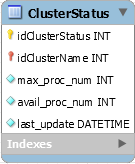

# Документация по проекту "Агент для высокопроизводительных вычислительных систем, интегрированный в единую среду Центра коллективного доступа"

## Содержание
<!-- TOC depthFrom:2 -->

- [Содержание](#содержание)
- [Взаимодействие с ВВК](#взаимодействие-с-ввк)
    - [Общая информация об агенте](#общая-информация-об-агенте)
    - [Конфигурирование и запуск агента](#конфигурирование-и-запуск-агента)
    - [Установка Агента в качестве демона (Linux)](#установка-агента-в-качестве-демона-linux)
    - [Общий алгоритм обработки входящего запроса](#общий-алгоритм-обработки-входящего-запроса)
    - [Таблица поддерживаемых команд](#таблица-поддерживаемых-команд)
    - [Таблица параметров конфигурации](#таблица-параметров-конфигурации)
- [Cистема доступа пользователей](#cистема-доступа-пользователей)
    - [Учетные записи пользователей и организаций](#учетные-записи-пользователей-и-организаций)
    - [Доступ к ВВК](#доступ-к-ввк)
- [Управление заданиями](#управление-заданиями)
    - [Постановка задачи на счет](#постановка-задачи-на-счет)
    - [Получение статуса задачи](#получение-статуса-задачи)
    - [Отмена счета задачи](#отмена-счета-задачи)
- [Загрузка файлов задачи](#загрузка-файлов-задачи)
- [Система шаблонов в описании планировщиков ВВК](#система-шаблонов-в-описании-планировщиков-ввк)
    - [Краткое описание системы](#краткое-описание-системы)
    - [Составные части системы](#составные-части-системы)
    - [Примеры работы классов системы](#примеры-работы-классов-системы)
        - [Пример работы класса `CmdTemplateResolver`](#пример-работы-класса-cmdtemplateresolver)
        - [Пример работы класса `HPCStatsResolver`](#пример-работы-класса-hpcstatsresolver)
    - [Таблица шаблонных символов](#таблица-шаблонных-символов)
    - [Пример описания планировщика в формате JSON](#пример-описания-планировщика-в-формате-json)
- [Система компиляции исходного кода задания](#система-компиляции-исходного-кода-задания)
- [Система хранения данных](#система-хранения-данных)
- [Программный интерфейс агента](#программный-интерфейс-агента)
- [Как была создана данная документация](#как-была-создана-данная-документация)

<!-- /TOC -->

## Взаимодействие с ВВК

Взаимодействие веб-приложения ЦКД с высокопроизводительным вычислительным комплексом (ВВК) происходит посредством специального агента, реализованного в рамках выполнения поставленной задачи.

### Общая информация об агенте

ВВК агент написан на языке Python с использованием только стандартной библиотеки языка версии 3.5.2. Следствием данного решения является его высокая переносимость на различные ВВК. 

Агент является посредником между веб-приложением ЦКД и системами управления задачами, стоящими на ВВК.

В агенте присутствуют две основные состоявляющие:

1. Сервер, принимающий и обрабатывающий запросы от веб-приложения ЦКД.
2. Сборщик информации о занятости ресурсов ВВК.

### Конфигурирование и запуск агента

Для запуска агента необходимо вызвать команду в командной строке следующего вида:

    python3 Agent.py /path/to/config [args]

Агент ВВК имеет конфигурацию по умолчанию, с параметрами которой можно ознакомиться, просмотрев файл `default.config`, находящийся в папке `config` проекта.

После указания пути к конфигурационному файлу есть возможно перезаписть некоторые параметры конфигурации, добавляя передкажды параметром префикс '--'.

Пример: `--log_level=DEBUG`.

### Установка Агента в качестве демона (Linux)

Для того, чтобы Агент ВВК мог запускаться автоматически при старте системы необходимо произвести действия, приведенные ниже. Для их совершения необходимы *__права администратора__*.

1. Создать папку `/usr/share/ckd-agent` и перенести туда содержимое папки с иходниками агента
2. Перенести содержимое папки `move_to_etc_init.d` исходников в папку `/etc/init.d`
3. Скопировать конфигурацию из папки `config` в папку `/etc/default`
4. Переименовать файл конфигурации в `agent-daemon`
5. Для регистрации демона в системе автозапуска выполнить команду
    
        sudo systemctl enable agent-daemon

6. Запустить агент командой
        
        sudo service agent-daemon start

Проверить статус агента можно при помощи команды

    sudo service agent-daemon status

Если будут вноситься изменения в `/etc/init.d/agent-daemon`, то для того, чтобы они вступили в силу необходимо выполнить следующие команды:

    sudo systemctl daemon-reload
    sudo service agent-daemon restart

Если необходимо изменить файл конфигурации, который будет использоваться по умолчанию при запуске агента, то необходимо поменять путь к конфигурации в `agent_daemon.sh`.

### Общий алгоритм обработки входящего запроса

Взаимодействие с агентом производится путем посылки ему с веб-приложения запросов. Каждый такой запрос является строковым представлением JSON-объекта следующего формата:

    {
        'cmd': < строковая команда >,
        'task_info': < JSON-представление информации о задаче >,
        'args': < дополнительные аргументы >
    }

Данные запросы обрабатываются классом `RequestHandler`. Для обработки каждой команды используется отдельный обработчик, который способна произвести фабрика `CmdHandlerFactory`. Таким образом, для добавления поддержки новых команд необходимо создать обработчик для новой команды, а также "обучить" фабрику создавать его.

Далее приведен список команд, поддерживаемых на данный момент.

### Таблица поддерживаемых команд

<table>
    <caption><b>Поддерживаемые команды</b></caption>
    <tr>
        <th>Команда</th>
        <th>Описание</th>
        <th>Необходимые элементы запроса</th>
        <th>Название класса-обработчика</th>
    </tr>
    <tr>
        <td>'run'</td>
        <td>Постановка задачи на счет</td>
        <td>cmd, task_info [, args]</td>
        <td>RunCmdHandler</td>
    </tr>
    <tr>
        <td>'stats'</td>
        <td>Получение статуса задачи</td>
        <td>cmd, task_info [, args]</td>
        <td>StatsCmdHandler</td>
    </tr>
    <tr>
        <td>'cancel'</td>
        <td>Снятие задачи со счета</td>
        <td>cmd, task_info [, args]</td>
        <td>CancelCmdHandler</td>
    </tr>
    <tr>
        <td>'hpc_stats'</td>
        <td>Получение информации о загруженности ВВК</td>
        <td>cmd</td>
        <td>HPCStatsCmdHandler</td>
    </tr>
    <tr>
        <td>'sources'</td>
        <td>Загрузка на сервер файлов с исходным кодом задачи</td>
        <td>cmd, task_info</td>
        <td>SourcesCmdHandler</td>
    </tr>
    <tr>
        <td>'results'</td>
        <td>Загрузка на сервер файлов с результатами и логами выполнения задачи</td>
        <td>cmd, task_info</td>
        <td>ResultsCmdHandler</td>
    </tr>
</table>

### Таблица параметров конфигурации

<table>
    <caption><b>Параметры конфигурации</b></caption>
    <tr>
        <th>Параметр</th>
        <th>Описание</th>
    </tr>
    <tr>
        <td>server_addr</td>
        <td>HTTP-адрес сервера с указанием порта, на котором поднято веб-приложение ЦКД 
        Если данный параметр не указан при запуске, то агент ожидает первого запроса для завершения своей инициализации</td>
    </tr>
    <tr>
        <td>work_dir</td>
        <td>Путь к директории, которая будет использована в качестве рабочей директории агента ВВК</td>
    </tr>
    <tr>
        <td>log_dir</td>
        <td>Путь к директори, в которой будут хранится логи работы агента ВВК</td>
    </tr>
    <tr>
        <td>log_level</td>
        <td>Уровень логирования, который будет использован при данном запуске агента ВВК   
        Доступные значения: DEBUG, INFO, ERROR</td>
    </tr>
    <tr>
        <td>log_max_kilobytes</td>
        <td>Максимальный размер файла с логами работы в килобайтах.    
        При превышении данного значения будет создан новый файл, а старый либо переименован, либо удален, если превышено максимально допустимое число версий файла с логами выполнения программы</td>
    </tr>
    <tr>
        <td>log_version_count</td>
        <td>Максимально допустимое число версий файла с логами выполнения программы</td>
    </tr>
    <tr>
        <td>host</td>
        <td>IP-адрес узла, на котором будет запущен агент    
        Примеры: localhost, 0.0.0.0</td>
    </tr>
    <tr>
        <td>port</td>
        <td>На каком порту будет вестись прослушка агентом для получения и обработки запросов</td>
    </tr>
</table>

[К содержанию](#содержание)

***

## Cистема доступа пользователей

### Учетные записи пользователей и организаций

На данный момент доступ к вычислительным ресурсам ВВК осуществляется через веб-приложение ЦКД и агент ВВК. Это означает, что нет необходимости создавать на ВВК отдельные учетные записи как для пользователей, так и для организаций.

### Доступ к ВВК

Для постановки задач на счет, снятия их со счета, получения их статуса, а также загрузки файлов с исходным кодом задач и результатами исполнения задач используются учетные записи пользователей к веб-приложению ЦКД. Доступ к ВВК при этом с их использованием по умолчанию невозможен.

Эти учетные записи (на данный момент только имя пользователя) используются агентом ВВК. С их помощью он определяет путь к папкам, где хранятся файлы, относящиеся к заданиям пользователя.

[К содержанию](#содержание)

***

## Управление заданиями

### Постановка задачи на счет

Данная функциональность реализуется в двух частях:

1. на этапе создания запроса к агенту на постановку задачи на стороне веб-приложения ЦКД;
2. непосредственно на стороне ВВК.

На стороне ЦКД это реализуется путем определения тех ВВК, на которых возможно поставить эту задачу на счет, а затем выбором из них ВВК, на который послать эту задачу. Эта информация берется из таблицы `ClusterStatus` базы данных на стороне веб-приложения, в которой хранится информация о загруженности ресурсов каждого из ВВК. Вид записи в таблице приведен ниже:

<table>
    <caption>
        <b>Описание полей таблицы ClusterStatus</b>
    </caption>
    <tr>
        <th>Поле</th>
        <th>Описание</th>
    </tr>
    <tr>
        <td>idClusterStatus</td>
        <td>уникальный идентификатор записи в таблице</td>
    </tr>
    <tr>
        <td>idClusterName</td>
        <td>идентификатор кластера, к которому относится эта запись</td>
    </tr>
    <tr>
        <td>max_proc_num</td>
        <td>максимальное число процессоров на ВВК на момент создания записи</td>
    </tr>
    <tr>
        <td>avail_proc_num</td>
        <td>число доступных (незагруженных) процессоров на ВВК на момент создания записи</td>
    </tr>
    <tr>
        <td>last_update</td>
        <td>дата и время создания запись</td>
    </tr>
</table>

Каждому ВВК соответствует только одна запись в этой таблице.

Алгоритм выбора ВВК для запуска задачи:

1. Сначала идет проверка того, есть ли в таблице записи, которые обновлялись слишком давно. Если таковые есть, то производится попытка обновить эту информацию параллельно для всех ВВК.
2. Затем происходит выборка тех ВВК, *доступное* число процессоров которых позволяет запустить на них пришедшую задачу. Если таковых нет, то происходит выборка ВВК, *максимальное* число процессоров которых позволяет запустить данную задачу.
3. Далее из подходящих ВВК выбирается один, на котором данная задача будет поставлена на счет.
4. После этого идет формирование сообщения для агента ВВК и его посылка.

Пример сообщения:

    {
        'cmd': 'run',
        'task_info': {
            'name':'test',
            'username':'test',
            'procnum': 24,
            'walltime': 15,
            'filename': 'archive.tar.gz',
            'filesize': 419,
            'compiler': 'mpicxx',
            'use_cmake': false
        },
        'args': '-fopenmp' 
    }

На стороне ВВК это сообщение обрабатывается классом `RequestHandler`, который определяет, какой именно пришел запрос, какая пришла информация о задаче и какие дополнительные аргументы были переданы. После этого идет запрос к фабрике обработчиков команд `CmdHandlerFactory`, которая возвращает необходимый обработчик.

Обработчик команды постановки задачи на счет производит:
1. уведомление сервера о принятии задачи;
2. компиляцию исходного кода задчи;
3. регистрацию необходимости ее запуска в системе запуска и управления заданиями ВВК, на котором работает агент;
4. обновлением информации о статусе задачи и о состоянии загруженности ВВК.

### Получение статуса задачи

Алгоритм получения статуса задачи:

1. Определяется ВВК, на котором была запущена задача
2. Формирование сообщения для агента ВВК и его посылка.

Пример сообщения:

    {
        'cmd': 'stats',
        'task_info': {
            'name':'test',
            'username':'test',
        },
        'args': ' 
    }

### Отмена счета задачи

Алгоритм отмены задачи:

1. Определяется ВВК, на котором была запущена задача
2. Формирование сообщения для агента ВВК и его посылка.

Пример сообщения:

    {
        'cmd': 'cancel',
        'task_info': {
            'name':'test',
            'username':'test',
        },
        'args': '' 
    }

[К содержанию](#содержание)

***

## Загрузка файлов задачи

Для загрузки файлов задачи применяются командные запросы `'sources'` и `'results'` с указанием в информации о задаче имя задачи, файлы которой необходимо получить.

По командному запросу `'sources'` будут возвращены файлы с исходным кодом задачи.

По командному запросу `'results'` будут возвращены файлы, являющиеся результатами выполнения задачи.

В обоих случаях файлы возвращаются в виде `zip`-архива.

Данные файлы загружаются на сервер веб-приложения ЦКД, где существуют еще 10 минут. Данный функционал реализуется благодаря функции `schedule_cleanup_files`. Такое решение является достаточно простым и не учитывает варианта, при котором происходит полное падение веб-приложения, так как в таком случае файлы, находящиеся в очереди на удаление, не будут удалены. В качестве одного из возможных дальнейших улучшений данный функционал можно вынести в отдельного демона, запущенного на том же сервере, где и веб-приложение.

[К содержанию](#содержание)

***

## Система шаблонов в описании планировщиков ВВК

### Краткое описание системы

Каждый планировщик имеет семантически схожие команды, которые всего лишь отличаются по синтаксису.
Для того, чтобы можно было описывать схожие действия различных систем запуска и управления заданиями, стоящими на ВВК, была создана система шаблонов, при помощи которой создаются их унифицированные описания.

Унификация описания планировщика заключается в следующем: за предопределенной семантикой команды планировщика закрепляется строка, содержащая текст команды, которую необходимо выполнить для достижения желаемого семантического эффекта, где конкретные цифры или же идентификаторы заменяются на шаблонные элементы специального вида.

### Составные части системы

Система шаблонов состоит из двух классов:
1. `CmdTemplateResolver`;
2. `HPCStatsResolver`.

`CmdTemplateResolver` отвечает за генерацию команд планировщика и паспорта задания, который тот может использовать, для каждой поступившей задачи. Т.е. этот класс занимается синтезом команд по заданному шаблону с использованием информации, актуальной непосредственно для конкретного вызова. 

`HPCStatsResolver` разбирается с выводом команды получения информации о загруженности ВВК. Таким образом, задачей этого класса является сопоставление полученного вывода с его шаблоном и выборка необходимой информации.

### Примеры работы классов системы

#### Пример работы класса `CmdTemplateResolver`

В описании планировщика SLURM команда получения информации о статусе задачи, представленная с точки зрения системы шаблонов может выглядеть следующим образом:

    squeue --clusters=all --jobs=@__jobid__@ --states=all

Положим, что приходит запрос на получение статуса задачи с идентификатором `2716`. Тогда при помощи класса `TemplateResolver` будет получена команда:

    squeue --clusters=all --jobs=2716 --states=all

#### Пример работы класса `HPCStatsResolver`

Положим, что в некоторый момент времени запрос информации о состоянии ВВК, полученный при помощи команды

    sinfo --clusters="all" --format="%a %N %C %T %m %O %R %z"

выдал следующий результат:

    CLUSTER: clustername
    AVAIL NODELIST CPUS(A/I/O/T) STATE MEMORY CPU_LOAD PARTITION S:C:T
    up ns[1-2] 0/64/0/64 idle 1 0.10-1.02 part1 4:8:1
    up ns[1-2] 0/64/0/64 idle 1 0.10-1.02 part2 4:8:1

Для разбора вывода этой команды был предложен шаблон следующего вида, в котором внимание уделяется получению информации о числе доступных процессоров и максимальном числе процессоров ВВК:

    @__irr__@
    @__irr__@
    @__irr__@ @__irr__@ @__irr__@/@__avail__@/@__irr__@/@__total__@ @__irr__@ @__infrep__@

Участвующие в примере шаблонные параметры означают следующее:
- `@\_\_irr__@` означает то, что позиция (или даже строка) является неактуальной для разбора, а значит ее можно игнорировать при разборе;
- `@\_\_avail__@` означает число доступных процессоров;
- `@\_\_total__@` означает максимальное число процессоров, которые могут быть доступны на данном ВВК;
- `@\_\_infrep__@` означает, что строка может быть повторена неограниченное количество раз в реальном выводе.

По шагам данное сопоставление будет происходить так:

1. `HPCStatsResolver` пытается "синхронизировать" шаблон и реальный вывод по числу строк, если это возможно (присутствует символ `@\_\_infrep__@`).

> После этого шага "синхронизированный" шаблон будет иметь следующий вид:

    @__irr__@
    @__irr__@
    @__irr__@ @__irr__@ @__irr__@/@__avail__@/@__irr__@/@__total__@ @__irr__@
    @__irr__@ @__irr__@ @__irr__@/@__avail__@/@__irr__@/@__total__@ @__irr__@

2. Выделяются строки, в которых содержатся релевантные шаблонные параметры (в данном случае - `@\_\_avail__@` и `@\_\_total__@`). Таким образом остаются только третья и четвертая строки "синхронизированного" шаблона.

> Вид шаблона, с которым ведется дальнейшая работа:

    @__irr__@ @__irr__@ @__irr__@/@__avail__@/@__irr__@/@__total__@ @__irr__@
    @__irr__@ @__irr__@ @__irr__@/@__avail__@/@__irr__@/@__total__@ @__irr__@

> Им соответствуют следующие строки реального вывода:

    up ns[1-2] 0/64/0/64 idle 1 0.10-1.02 part1 4:8:1
    up ns[1-2] 0/64/0/64 idle 1 0.10-1.02 part2 4:8:1

3. Далее в оставшихся строках ищутся непосредственно актуальные позиции. Для этого строка разбивается по пробельным символам и полученное представление фильтруется относительно релевантных шаблонных параметров.

> Таким образом в шаблоне остаются следующие позиции:

    @__irr__@/@__avail__@/@__irr__@/@__total__@ @__irr__@
    @__irr__@/@__avail__@/@__irr__@/@__total__@ @__irr__@
    
> которым соответствуют следующие позиции реального вывода:

    0/64/0/64
    0/64/0/64

4. После этого определяются символы, которые разделяют шаблонные параметры.

> В данном случае таким символом-разделителем является '/'.

5. Оставшиеся анализируемые элементы разбиваются по символам-разделителям, после чего происходит сопоставление релевантных шаблонных параметров с реальными значениями, им соответствующими, и подсчет интересуемой статистики.

> На этом этапе получаем соответствия следующего вида:

    __avail__: 64, __total__: 64
    __avail__: 64, __total__: 64

> На выходе получается, что общее число доступных процессоров, как и максимальное число процессоров составляет 128.

### Таблица шаблонных символов

<table>
    <caption><b>Шаблонные символы классов и их семантика</b></caption>
    <tr>
        <th>Класс</th>
        <th>Шаблонные символы</th>
        <th>Описание</th>
    </tr>
    <tr>
        <td>CmdTemplateResolver</td>
        <td>__procnum__</td>
        <td>Число процессоров, на которых необходимо запустить задачу</td>
    </tr>
    <tr>
        <td/>
        <td>__walltime__</td>
        <td>Время, которое выделяется на выполнение задачи</td>
    </tr>
    <tr>
        <td/>
        <td>__memory__</td>
        <td>Память, которая выделяется на выполнение задачи</td>
    </tr>
    <tr>
        <td/>
        <td>__filename__</td>
        <td>Имя файла, содержащего исходный код задачи</td>
    </tr>
    <tr>
        <td/>
        <td>__passport__</td>
        <td>Путь к файлу, содержащему паспорт задания для планировщика</td>
    </tr>
    <tr>
        <td/>
        <td>__jobid__</td>
        <td>Идентификатор задачи, поставленной на счет на ВВК</td>
    </tr>
    <tr>
        <td/>
        <td>__name__</td>
        <td>Название задачи</td>
    </tr>
    <tr>
        <td/>
        <td>__binname__</td>
        <td>Путь к исполняемому файлу, скомпилированного из исходного кода задачи</td>
    </tr>
    <tr>
        <td/>
        <td>__logname__</td>
        <td>Путь к файлу, содержащему лог компиляции и/или выполнения задачи</td>
    </tr>
    <tr>
        <td>HPCStatsResolver</td>
        <td>__irr__</td>
        <td>Нерелевантная позиция вывода</td>
    </tr>
    <tr>
        <td/>
        <td>__avail__</td>
        <td>Доступное число процессоров</td>
    </tr>
    <tr>
        <td/>
        <td>__total__</td>
        <td>Максимальное число процессоров</td>
    </tr>
    <tr>
        <td/>
        <td>__infrep__</td>
        <td>Строка может быть повторена неограниченное число раз в реальном выводе</td>
    </tr>
</table>

### Пример описания планировщика в формате JSON

При запросе информации о планировщиках агенту ВВК формируется сообщение в виде JSON-объекта, содержащего записи в формате JSON следующего вида:

    {
        "name": "SLURM",
        "run_task": "sbatch @__descname__@",
        "cancel_task": "scancel @__jobid__@",
        "task_stats": "squeue --clusters=all --jobs=@__jobid__@ --states=all",
        "desc_file": "#!/bin/sh\n#SBATCH --time=@__walltime__@\n@__MPI__@ mpirun -n @__procnum__@ @__binname__@ >@__logname__@ 2>&1\n@__NO_MPI__@ srun @__binname__@ >@__logname__@ 2>&1",
        "jobid_template": "Submitted batch job @__jobid__@",
        "hpc_stats": "sinfo --clusters=\"all\" --format=\"%a %N %C %T %m %O %R %z\"",
        "stats_pattern": "@__irr__@\r\n@__irr__@\r\n@__irr__@ @__irr__@ @__irr__@/@__avail__@/@__irr__@/@__total__@ @__irr__@ @__infrep__@",
        "running_status": "CONFIGURING, CF, RUNNING, R, COMPLETING, CG",
        "cancelled_status": "CANCELLED, CA",
        "error_status": "BOOT_FAIL, BF, FAILED, F, PREEMPTED, PR, NODE_FAIL, NF, TIMEOUT, TO",
        "queued_status": "PENDING, PD, SUSPENDED, S, SPECIAL_EXIT, SE",
        "completed_status": "COMPLETED, CD"
    }

[К содержанию](#содержание)

***

## Система компиляции исходного кода задания

Подсистема компиляции представлена классами в папке `src/agent/compilation_handling`. Присутствует поддержка как компиляция одного файла, так и всех исходников, присутствующих в архиве. 

Присутствует поддержка сборки задания при помощи механизма CMake. Для этого необходимо отметить в интерфейсе запуска задачи, что необходимо использовать CMake, а также либо предоставить, либо довериться атоматической генерации файла `CMakeLists.txt`, который будет использоваться для сборки.

[К содержанию](#содержание)

***

## Система хранения данных

Хранение данных осуществляется на ВВК. На сервер они подгружаются только в трех случаях:

1. Постановка задачи на счет. В этом случае они загружаются на сервер, отправляются на ВВК, после чего происходит удаление файлов задания.
2. При возникшей у пользователя необходимости загрузить исходный код задачи. В этом случае папка с исходным кодом архивируется на стороне ВВК и отправляется на сервер. Этот архив хранится на стороне сервера 10 минут, после чего удаляется.
3. Для загрузки результатов выполнения задачи пользователем. В этом случае так же создается архив со всеми логами и файлами, созданными в рамках выполнения задачи, и этот архив отправляется на сервер. Время его "жизни" на сервере составляет те же 10 минут.

За отложенное удаление загруженных файлов на данный момент отвечает функция `schedule_clean_up_files` в файле `apps.py` на стороне веб-приложения ЦКД.

Файлы заданий хранятся по следующему пути: `/path/to/workdir/username/taskname`, где

* `workdir` - рабочая директория агента, которая задается при запуске агента либо через файл конфигурации, либо в качестве аргумента командной строки;
* `username` - имя пользователя, от которого приходит запрос;
* `taskname` - название задания, поступившего с запросом, если таковое было.

[К содержанию](#содержание)

***

## Программный интерфейс агента

Документация по программному интерфейсу агента генерируется автоматически при помощи скрипта `build_docs.py`, использующего модуль `pydoc` стандартной библиотеки языка Python.

Для генерации веб страниц формата HTML необходимо выполнить следующую команду:

    python3 build_docs.py /path/to/project

После чего в папке `doc` проекта будут сгенерированы веб-страницы с информацией о классах и методах проекта.

Данная документация генерируется по исходному коду проекта, а также комментариям в нем. Для того, чтобы был виден комментарий к методу или классу, его необходимо писать либо прямо перед объявлением класса (метода, функции,...), либо сразу после объявления сущности.

[К содержанию](#содержание)

***

## Как была создана данная документация

Данная документация была создана на языке разметки Markdown.

Перевод в PDF (HTML) осуществлялся при помощи плагина `Markdown PDF` для текстового редактора `Visual Studio Code`.

[К содержанию](#содержание)

***